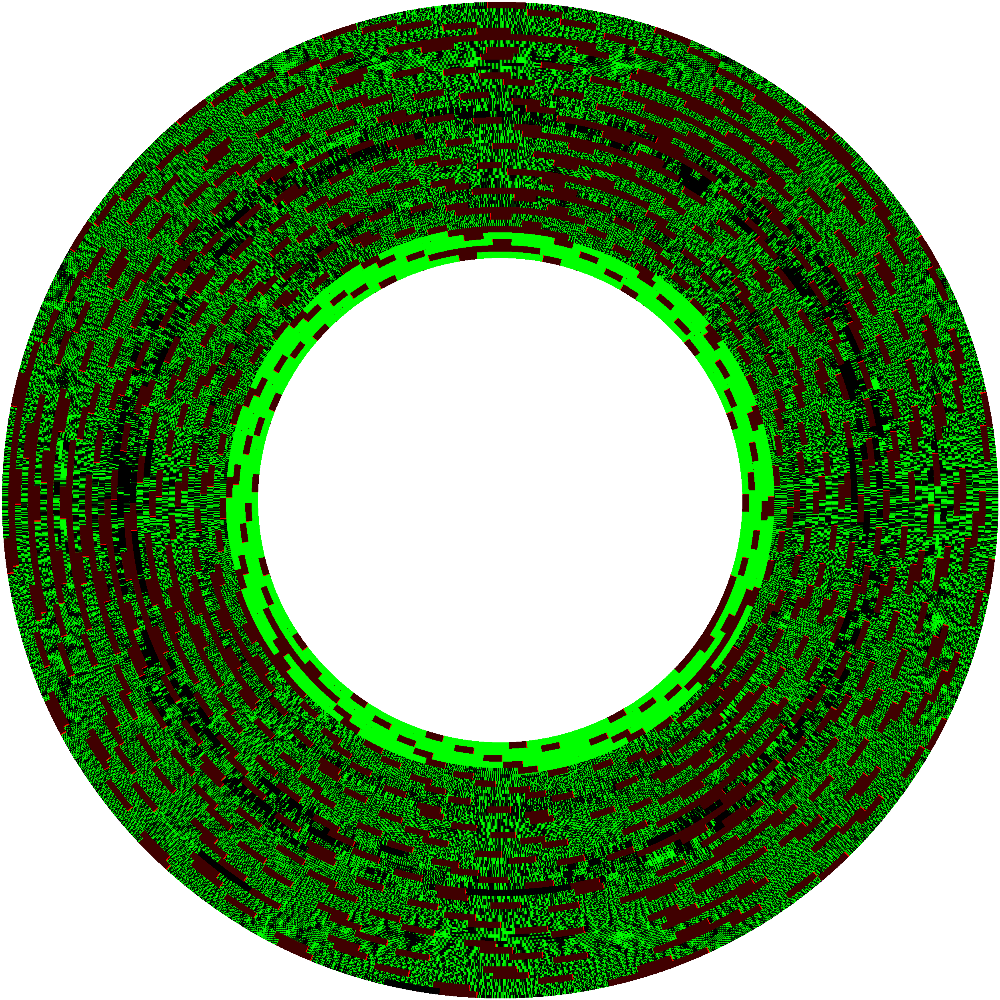
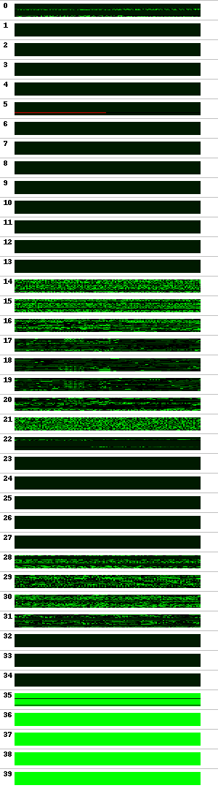

# Pharaoh's Curse

I've never really wrote any code for the Atari 400/800 computers, so this is my first look into the hardware and software by using Pharaoh's Curse as a learning example. 6502 I knew via the C64, etc, but I knew almost nothing about the graphics and sound capabilities.

Documented source code for Pharaoh's Curse for the Atari 400/800 computers.
Requires the [CA65 assembler](https://cc65.github.io) to compile.

## Files to start with

- [Pharaoh's Curse - manual](Pharaohs_Curse_Synapse_Software_manual.pdf)
- [Pharaoh's Curse - protected ATX disk image](Pharaohs_Curse.atx)
- [Pharaoh's Curse - patched unprotected ATR disk image](Pharaohs_Curse.atr)

## Extracting the game from the ATX disk image

I first wrote [read_atx.py](read_atx.py) to extract the game code from the protected disk image "`Pharaoh's Curse, The (1983)(Synapse Software)(US).atx`". The script displays the structure of the disk as readable text. But it can also generate visual images of it:

The disk boots directly and read sector #1-#3 to `$0480`. It then checks for a cartridge and forces you to remove it. Further it displays a loading text, starts loading 143 sectors beginning at sector #256 at `$05BE` up to `$4DBD`.

After that the copy protection is checked: sector #94 is read 10 times and because it exists 8 times in that track, it reads much faster than the expected 2s it normally takes.

Additionally Sector #98 is read and should return a CRC error.

If all that succeeds, the game is initialized and starts.

During the game play the checksum over the copy protection code is checked in a few places to avoid tempering with it!

## Analyzing the game code

I saved the whole memory from `$0480…$4DBD` into [Pharaohs_Curse.bin](Pharaohs_Curse.bin) to further analyze it. It uses standard Atari OS and no unexpected tricks for sound or graphics – just regular Atari Display List stuff.

So I wrote [image_extract.py](image_extract.py) to display all the font and PM artwork as well as creating an image for all the 16 levels. They are aligned in a way, that leaving on one side leads you to the one next to it. The title screen is level 14, which can't be reached during normal gameplay. That level also uses a special font for the title games and the text display. The arrow in the level mark starting points when getting into the level from the 4 different directions. The red rectangles are the one possible elevator per level and white letters mark keys, treasures, traps and doors. They typically appear as double characters, so there are two letters per e.g. key.

